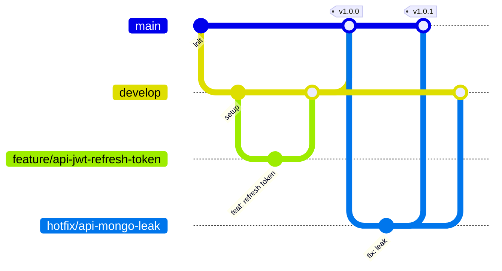

# Guide de contribution — LogiChain

Ce document formalise la manière de travailler sur ce dépôt : stratégie de
branches, politique de commit, processus de Pull Request. Il s'adresse à
toute personne (ou équipe) qui reprend le projet.

## 1. Structure du dépôt (monorepo)

```
Logichain/
├── logichain-api/       # Back-end Node.js (voir logichain-api/README.md)
├── logichain-mobile/     # App mobile Expo/React Native (voir logichain-mobile/README.md)
├── qrcodes-simulation/   # Jeu de QR codes de démo pour les tests terrain
├── ansible/               # Provisionnement & déploiement du serveur (à venir)
├── .github/workflows/     # Pipelines CI/CD (à venir)
├── CONTRIBUTING.md
└── README.md
```

**Pourquoi un monorepo plutôt que deux dépôts séparés ?**

- L'API et l'app mobile partagent un même contrat REST et évoluent en
  parallèle : une évolution d'endpoint touche souvent les deux projets dans
  le même ticket. Un seul repo = une seule PR, un seul historique cohérent
  pour ce changement.
- Équipe réduite (école) : un seul jeu de règles de protection de branches,
  un seul pipeline CI à maintenir, une seule fenêtre de revue.
- Les deux sous-projets restent isolés dans leurs propres dossiers avec leurs
  propres `package.json`/dépendances : rien n'empêche de les extraire plus
  tard vers des repos dédiés si l'équipe grandit (le mono-repo n'est pas un
  couplage technique, juste un choix d'organisation).
- Le CI/CD utilise du *path filtering* (voir `.github/workflows/`) pour ne
  déclencher les tests/lint de l'API que si `logichain-api/**` change, et
  ceux du mobile que si `logichain-mobile/**` change — on garde l'avantage
  de repos séparés sans en payer le coût de coordination.

## 2. Stratégie de branches (Gitflow simplifié)

Deux branches longues, protégées, jamais alimentées par un push direct :

| Branche   | Rôle                                   | Protégée |
|-----------|-----------------------------------------|----------|
| `main`    | Code en production, toujours déployable | Oui      |
| `develop` | Intégration continue des features       | Oui      |

Branches courtes, créées depuis `develop` et supprimées après merge :

| Préfixe     | Usage                                  | Part de   | Merge vers |
|-------------|------------------------------------------|-----------|------------|
| `feature/*` | Nouvelle fonctionnalité                  | `develop` | `develop`  |
| `fix/*`     | Correction de bug non urgente            | `develop` | `develop`  |
| `hotfix/*`  | Correction urgente en production         | `main`    | `main` **et** `develop` |

Convention de nommage : `type/scope-description-courte`, en minuscules,
mots séparés par des tirets. Exemples :

```
feature/api-jwt-refresh-token
feature/mobile-offline-sync-queue
fix/api-optimistic-lock-race-condition
hotfix/api-mongo-connection-leak
```



## 3. Politique de commit — Conventional Commits

Tous les commits suivent le standard
[Conventional Commits](https://www.conventionalcommits.org/) :

```
<type>[scope optionnel]: <description au présent, courte>

[corps optionnel : le pourquoi, pas le quoi]

[footer optionnel : BREAKING CHANGE: ..., Refs #12]
```

Types autorisés :

| Type       | Usage                                                |
|------------|-------------------------------------------------------|
| `feat`     | Nouvelle fonctionnalité                                |
| `fix`      | Correction de bug                                      |
| `docs`     | Documentation seule                                    |
| `refactor` | Changement de code sans effet fonctionnel               |
| `test`     | Ajout/correction de tests                               |
| `chore`    | Maintenance (deps, config) sans impact fonctionnel      |
| `ci`       | Pipelines CI/CD                                         |
| `build`    | Ansible, scripts de déploiement, provisionnement        |
| `perf`     | Amélioration de performance                             |

Exemples :

```
feat(api): ajoute le refresh token JWT
fix(mobile): corrige la file de synchronisation offline
ci: ajoute le job de lint sur les PR vers develop
build(ansible): ajoute le rôle Database avec authentification MongoDB
```

## 4. Processus de Pull Request

1. Créer la branche depuis `develop` (ou `main` pour un `hotfix/*`).
2. Ouvrir la PR dès que possible en *draft* si le travail est en cours.
3. La PR doit cibler `develop` (jamais `main` directement, sauf `hotfix/*`).
4. Le pipeline CI doit être **vert** (lint + tests) avant toute revue.
5. **Au moins une revue de code approuvée** est obligatoire avant le merge
   (voir règles de protection de branche ci-dessous).
6. Merge en **squash** pour garder un historique `develop`/`main` lisible
   (un commit = une PR = une ligne de changelog).
7. Supprimer la branche après merge.

Le template de PR (`.github/pull_request_template.md`) impose une checklist
(tests locaux passés, variables d'env documentées si ajoutées, pas de secret
commité).

## 5. Installation locale

Voir le README de chaque sous-projet pour le détail :

- [`logichain-api/README.md`](logichain-api/README.md)
- [`logichain-mobile/README.md`](logichain-mobile/README.md)

Résumé des variables d'environnement (API) — voir
`logichain-api/.env.example`, à copier en `.env` (jamais commité) :

| Variable               | Rôle                                      |
|-------------------------|---------------------------------------------|
| `MONGODB_URI`            | URI de connexion MongoDB                     |
| `MONGODB_DB`             | Nom de la base                               |
| `PORT`                   | Port d'écoute HTTP de l'API                  |
| `JWT_ACCESS_SECRET`      | Secret de signature des access tokens        |
| `JWT_REFRESH_SECRET`     | Secret de signature des refresh tokens       |
| `TLS_KEY_PATH` / `TLS_CERT_PATH` | Optionnel, HTTPS natif                |

**Aucun `.env` ne doit jamais être commité** — seul `.env.example` (valeurs
factices) est versionné. En production, les vraies valeurs sont injectées
via les secrets GitHub Actions et Ansible Vault (voir chantier Ansible/CI).

## 6. Règles de protection de branche (à configurer sur GitHub)

À faire une fois dans *Settings → Branches → Add branch ruleset* pour
`main` et `develop` :

- Require a pull request before merging
- Require approvals: **1 minimum**
- Dismiss stale approvals on new commits
- Require status checks to pass before merging (une fois la CI en place :
  jobs `lint` et `test`)
- Require branches to be up to date before merging
- Include administrators (même le mainteneur passe par la PR)
- Do not allow bypassing the above settings
- Sur `main` uniquement : Require linear history, bloquer le force-push

Script `gh` équivalent (à lancer soi-même, avec un `gh auth login` admin
sur le repo) : [`scripts/setup-branch-protection.sh`](scripts/setup-branch-protection.sh).
